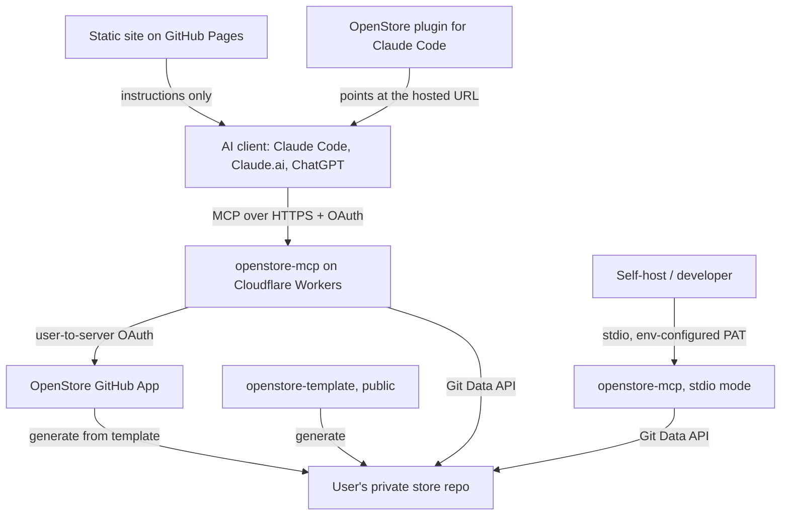
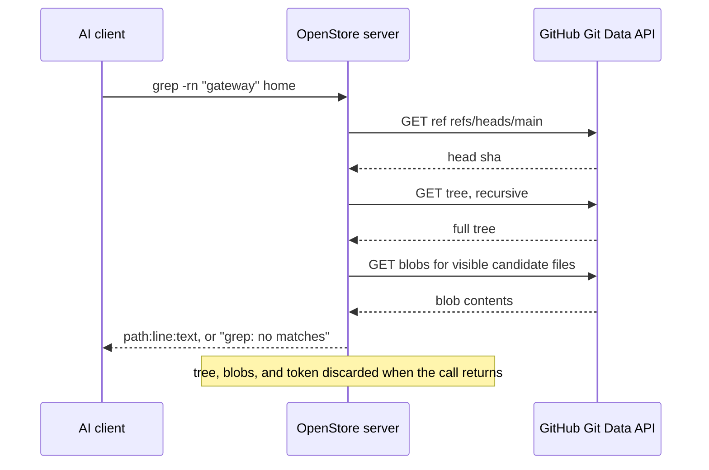
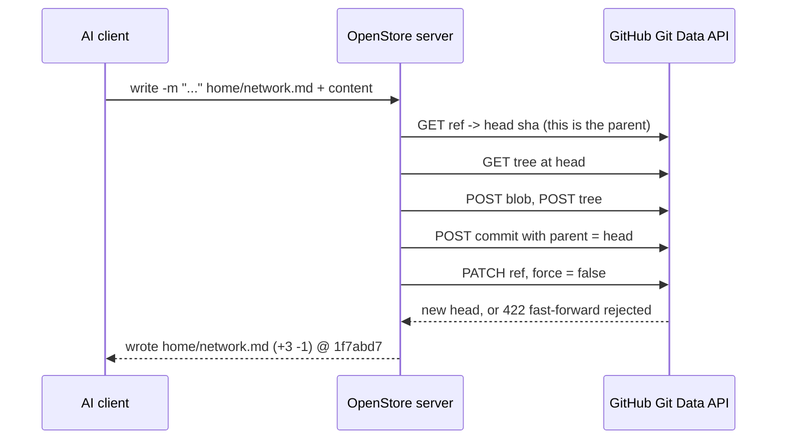
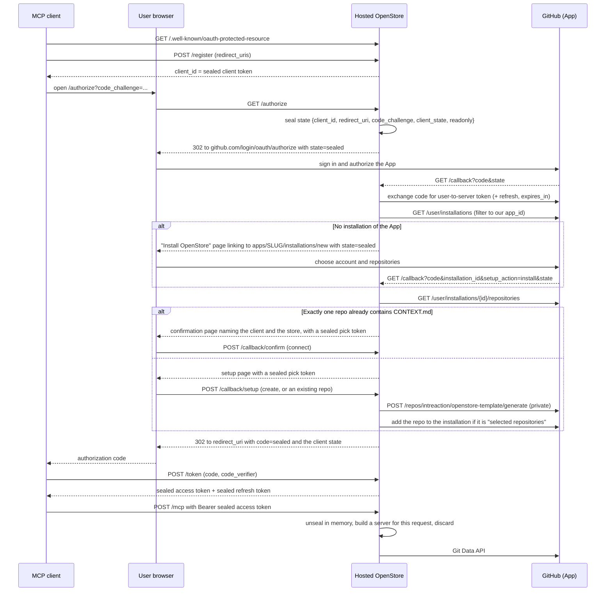

# OpenStore Architecture

Status: v0.1 in progress, September 6, 2026.

This document describes how OpenStore is built. See `concept.md` for what OpenStore is and why,
`design.md` for the product surface and the exact tool contract, and `plan.md` for the delivery
sequence.

## 1. Architectural objective

Make a user-owned private GitHub repository of Markdown available to AI clients as durable,
inspectable memory. The repo is the only source of truth. OpenStore adds access, not a second
store.

Two properties drive every decision below.

1. The server holds nothing between requests. No database, no cache, no disk, no in-memory state
   that outlives one tool call.
2. The tools look and behave like bash. Models already know `ls`, `grep`, `cat`, and `git log`.

Markdown and Git stay useful with OpenStore removed. That is the point.

The critical path is short:

```text
AI calls grep
    -> server resolves head and reads the tree from GitHub
    -> server returns path:line:text
    -> AI calls write after the user agrees
    -> server creates one commit on the branch
```

## 2. Components



| Component | Responsibility |
| --- | --- |
| GitHub App | The identity. The user signs in with GitHub, the App is installed on their account, and its user-to-server token is the only credential OpenStore ever uses |
| Template repo | Public `intreaction/openstore-template`, marked as a template. The starting shape of a store: `README.md`, `CONTEXT.md`, and a few starter folders |
| Static site | GitHub Pages page that explains OpenStore and how to connect it. Purely informational. No backend, no accounts, and no button that touches GitHub |
| MCP server | One TypeScript codebase, two entry points: hosted (Workers) and stdio. Stateless in both |
| Plugin | Claude Code plugin. It no longer spawns a process; it points the client at the hosted HTTP endpoint |

The user never types a token and never copies a repo name. The plugin (or a connector URL) triggers
the standard MCP OAuth flow, our app signs them in with GitHub, creates their store if they do not
have one, and hands the client a sealed access token.

The server is one code path. The stdio entry reads config from environment variables. The hosted
entry reads the same config from a sealed token on the request. Everything below the entry point
is identical, which is why self-hosting runs the code you already audited.

Internally the server splits into a `Store` interface, a bash-quote tokenizer and flag parser,
path visibility rules, and one pure module per tool. `design.md` lists the tools; the
implementation layout lives in the brief and in `server/src`.

## 3. Per-call data flow

Every tool call is self-contained. It starts by resolving the branch head and ends with nothing
retained.

Read call:



Write call:



Notes that matter:

- Resolve head once, fetch the recursive tree once, then operate. The tree is never held across
  calls.
- Blobs are fetched only for files the command actually needs and only for visible paths.
- One tool call is exactly one commit. No staging area, no batching across calls.
- Reads are consistent within a call because they are all taken from one resolved head. Two
  separate calls may see two different heads. That is normal and correct.

## 4. Concurrency model

The rules are the ones Git already gives us.

- The parent of every new commit is the head that was read at the start of that call.
- The ref update is non-forced. GitHub rejects it if the branch moved. Nothing is overwritten.
- On rejection, retry the whole read-modify-commit cycle: re-resolve head, re-read the tree,
  re-apply the operation, commit again. Up to 3 attempts.
- After 3 attempts, fail with `error: failed to push: branch advanced concurrently, retry`.

Retrying the whole cycle, not just the ref update, is what makes concurrent writes safe. A stale
tree with a fresh parent would silently discard the other writer's work.

History is append-only. OpenStore never force-pushes and never rewrites history. Undo is
`git_revert`, which is a new commit that reverses an old one. A revert that would conflict with
later changes to the same files fails rather than guessing.

An externally forced history rewrite by the repo owner is outside normal operation. The next call
simply resolves whatever head it finds.

## 5. Trust boundaries and the hosted mode

There are two credentials and they must not be confused.

1. The GitHub user-to-server token that authorizes OpenStore to act on the store repo.
2. The MCP access token that authorizes a client to talk to a hosted OpenStore endpoint.

In stdio mode there is only the first, and it is a fine-grained personal access token scoped to the
single store repo, read from the environment of the process the user launched. Stdio is now the
developer and self-host path. It never leaves the user's machine except to reach github.com.

In hosted mode the first credential is issued by the OpenStore GitHub App and the second is a
sealed blob the client holds. The user enters neither.

### The GitHub App is the login

The App is registered with "Request user authorization (OAuth) during installation" and "Expire
user authorization tokens" both on, webhooks off, and permissions Contents: read and write,
Metadata: read, and Administration: write. Administration is not optional: both of the endpoints
that can create a store repository require it, so an App registered without it can only ever offer
the Advanced branch. It is installable by any account. `docs/github-app-setup.md` records the exact
registration settings.

Signing in with the App gives us three things a plain OAuth app does not. Access is scoped to the
repositories the user selected at install time, not to every repo they can reach. User-to-server
tokens expire in eight hours and carry a refresh token, so a leaked sealed blob has a short life.
And the installation itself is the user's revocation switch: uninstall the App and every sealed
token stops working at once.

### Sealed tokens

The hosted mode has no database, so it cannot keep a table of clients, authorization codes,
sessions, or grants. Every piece of state that a stateful authorization server would put in a row
is instead sealed into a string and handed to whoever needs to send it back.

`seal()` and `unseal()` are AES-256-GCM through WebCrypto (`crypto.subtle`, present in Workers and
in Node 22). One symmetric key lives in `OPENSTORE_SEAL_KEY`, 32 bytes base64. The wire format is
`os1.<base64url iv>.<base64url ciphertext>` and the plaintext is JSON `{ t, iat, exp, ...fields }`.
`unseal(token, key, expectedType)` rejects a wrong type, an expired token, or a tampered one with a
single generic error, so nothing about the failure is observable.

| `t` | Fields | Expiry | Held by |
| --- | --- | --- | --- |
| `client` | `redirect_uris[]`, `client_name` | none | the client, as its `client_id` |
| `state` | `client_id`, `redirect_uri`, `code_challenge`, `client_state?`, `resource?`, `readonly`, `client_name?` | 10 min | GitHub, as the `state` parameter |
| `pick` | everything in `state`, plus `gh_access`, `gh_refresh?`, `gh_exp?`, `repos[]`, `login`, `installation_id?`, `created?` | 10 min | the setup page, in a hidden field |
| `code` | `client_id`, `redirect_uri`, `code_challenge`, `gh_access`, `gh_refresh`, `gh_exp`, `repo`, `readonly` | 5 min | the client, as the authorization code |
| `access` | `client_id`, `gh_access`, `repo`, `readonly` | min(GitHub expiry, 8 h) | the client, as its Bearer token |
| `refresh` | `client_id`, `gh_refresh`, `repo`, `readonly` | 180 days | the client, as its refresh token |

There is no server-side copy of any of these. Revocation happens in GitHub: uninstall the App or
revoke the authorization, and the `gh_access` inside the sealed blob stops working.

### Routes

`server/src/http/app.ts` is one Hono app mounted by both `src/worker.ts` and a Node dev entry.

| Route | Purpose |
| --- | --- |
| `GET /.well-known/oauth-authorization-server` | Issuer = origin, `authorize`/`token`/`register` endpoints, S256 only, `token_endpoint_auth_methods_supported: ["none"]`, scopes `store` and `store:readonly` |
| `GET /.well-known/oauth-protected-resource` (and the `/mcp` and `/mcp/readonly` suffixed forms the MCP spec allows) | Resource = the matching `<origin>/mcp` path, pointing at the authorization server above |
| `POST /register` | RFC 7591 dynamic registration. Returns a sealed `client` token as `client_id` and no secret. Redirect URIs must be https, or http on `localhost`, `127.0.0.1` or `[::1]` with any port, must carry no credentials or fragment, and are capped at 512 characters each because each one is sealed into the `client_id` that in turn rides inside every later token |
| `GET /authorize` | Validates `response_type=code`, the sealed `client_id`, an exact-match `redirect_uri`, `code_challenge` with `S256`, optional `scope` and RFC 8707 `resource`. Seals a `state` token and redirects to GitHub |
| `GET /callback` | Handles both the sign-in return and the App-install return. Exchanges the code, lists the user's installations of this App, then offers the install page, the confirmation page, or the setup page. It never redirects to the client |
| `POST /callback/confirm` | The returning user's one click. Unseals the `pick`, checks the chosen repo is in its sealed list, and redirects to the client with a sealed `code`. The page's "use a different repository" link comes back here too and renders the full setup page |
| `POST /callback/setup` | Creates the store from the template, or accepts the chosen existing repo (validated against the sealed list), then redirects to the client with a sealed `code`. A repository the installation still cannot see ends on a short "grant access and continue" page |
| `POST /token` | `authorization_code` (verifies PKCE, client, and redirect URI) and `refresh_token` (refreshes at GitHub and issues a new pair). RFC 6749 JSON errors |
| `POST /mcp` | The protected resource. Bearer sealed `access` token |
| `POST /mcp/readonly` | The same, with read-only forced regardless of what the token says |
| `GET /` | A short page saying what the endpoint is, linking to the site, and stating the trust statement |

The `/.well-known/oauth-authorization-server` document is served at its `/mcp` and `/mcp/readonly`
suffixed paths too, so a client that appends the resource path finds it either way.

`GET /mcp` and `DELETE /mcp` return 405: the transport is stateless, so there is no stream to open
and no session to delete. CORS allows `Authorization`, `Content-Type`, and `Mcp-Protocol-Version`
from any origin on `/mcp` and the well-known routes, because browser-based clients exist.

### The login flow



Three details in that diagram carry weight.

The install hand-off preserves `state`. When the App is not installed yet we send the user to
GitHub's install page with our own sealed `state` on the URL, and GitHub gives it back to our
callback along with `installation_id` and `setup_action=install`. That is what lets one stateless
handler serve both arrivals.

The setup page creates the store by default. The user sees one primary action, "Create your
OpenStore", prefilled with a private repo named `my-openstore` generated from the public template.
Choosing an existing repository, and asking for read-only access, live under a collapsed
"Advanced". Template generation is asynchronous, so the handler polls briefly until the new repo's
default branch resolves before it issues the code.

The returning-user shortcut skips the page entirely. If the installation grants exactly one repo
that has `CONTEXT.md` at the root of its default branch, that is the store, and the second sign-in
is a redirect the user barely sees.

Auth-code replay inside the five-minute window cannot be prevented without state, because there is
nowhere to record that a code was used. It is mitigated by PKCE: the code is bound to a
`code_challenge`, and the verifier never leaves the client that created it. We say so plainly
rather than implying single use.

`/mcp/readonly` forces read-only regardless of the token, so a user can hand out a strictly
read-only URL without minting a second token. The readonly flag inside the sealed token does the
same thing from the other direction, set by the Advanced checkbox and reflected in the granted
scope. In read-only mode the four write tools are not registered at all, so a client cannot call
them by name.

The MCP authorization rules still apply. The sealed blob is issued for this server, is validated by
this server, and is never passed downstream. GitHub is the only outbound destination, and it
receives the GitHub token, not the sealed blob.

### The stateless MCP handler

`POST /mcp` reads `Authorization: Bearer`. A missing or invalid token is a `401` carrying
`WWW-Authenticate: Bearer resource_metadata="<origin>/.well-known/oauth-protected-resource"`, which
is how a compliant client discovers where to authorize.

A valid token is unsealed into `{ repo, token: gh_access, readonly, client: "hosted" }`, the same
config shape the stdio entry builds from environment variables. The handler then constructs a fresh
`McpServer` with the existing `createServer` from `src/server.ts` and hands the request to the
SDK's web-standard Streamable HTTP transport in stateless mode: no session id, no stream held open,
JSON responses. Server and transport are created and thrown away inside one request.

Everything below that line is the code phase 0 already shipped and tested. The store, the tokenizer,
the path rules, and the commands are unchanged and shared; the only Node-specific code lives behind
the stdio entry, so the shared path runs on Workers unmodified.

### Deployment shape

`server/wrangler.toml` is `name = "openstore-mcp"`, `main = "src/worker.ts"`, a current
`compatibility_date`, and **no bindings of any kind**. No KV namespace, no D1 database, no R2
bucket, no Durable Object, no queue. Non-secret vars are `GITHUB_APP_SLUG`, `GITHUB_APP_ID`,
`PUBLIC_SITE_URL`, and `OPENSTORE_TEMPLATE_REPO`, plus an optional `PUBLIC_BASE_URL` for a Worker
behind a custom domain. Secrets, set with `wrangler secret put`, are `GITHUB_CLIENT_ID`,
`GITHUB_CLIENT_SECRET`, and `OPENSTORE_SEAL_KEY`.

`GITHUB_APP_ID` is required, not optional. It is the only thing separating our installations from
every other GitHub App the user has installed, so a deploy without it refuses `/authorize`,
`/callback`, `/callback/confirm`, `/callback/setup` and `/token` with a "not configured" page rather than quietly
enumerating another App's repositories. Discovery and `/mcp` keep working, because neither needs it.

That file is the audit. A reader can confirm in ten seconds that the Worker has nowhere to write,
which is a stronger statement than any sentence in a privacy policy. `docs/deploy.md` has the
steps; `scripts/gen-seal-key.mjs` mints the key and `scripts/seal-dev-token.ts` mints a local
sealed `access` token so `/mcp` can be exercised before the App exists.

### What the browser-facing pages are hardened against

Dynamic client registration means anyone can register a client, and the whole flow is stateless, so a
few things are worth stating plainly.

Every HTML page is served `Cache-Control: no-store`, `Referrer-Policy: no-referrer`,
`X-Content-Type-Options: nosniff`, `X-Frame-Options: DENY` and
`Content-Security-Policy: default-src 'none'; style-src 'unsafe-inline'; img-src data:; base-uri 'none';
frame-ancestors 'none'`. None of these pages contains a script, and the setup page carries a sealed
`pick` token in a hidden field, so the policy is a second lock behind the escaping: markup is built
only by a tagged template that escapes every interpolation unless it is explicitly marked safe.

Every code passes a page that names the client. The setup page and the confirmation page both name the
client that is connecting and the host its code will be sent to, so a user always gets one moment to
notice a connection they did not start. A returning user whose store is found automatically sees the
confirmation page rather than a redirect: registration is open to anyone, and without that page a
single crafted link would carry a user who has already authorized the App straight through to a token
for a client they never chose. PKCE does not help there, because the hostile client holds the verifier.

One limit is honest rather than solved. An authorization code can be replayed inside its five-minute
window, because refusing a second use would need a server-side record of the first; PKCE binds the code
to a verifier that never leaves the client, which is the mitigation.

### The exact trust statement

Say this plainly, in the docs and on the site:

> OpenStore never stores a copy of your content. The hosted server keeps no database, no cache,
> and no files. Your content and your GitHub token pass through server memory during a request and
> are gone when it returns. A hosted operator could, in principle, read traffic while it is in
> flight. Nothing is retained. Self-hosting the same open-source code removes even that.

Do not soften it and do not overclaim it. "We cannot see your data" would be false for the hosted
mode. "We keep nothing" is true and is the guarantee we make.

## 6. Sandbox and visibility

The sandbox is a property of path resolution, not of a shell. There is no shell. Tool arguments
are tokenized with bash quoting rules and parsed into structured flags. Nothing is executed.

Path rules, applied to every argument of every tool:

- Repo-relative paths only. Absolute paths, `..` segments, `//`, backslashes, and a leading `~`
  are refused with `Permission denied`. These are attempts to leave the store, not references to
  something in it, so the honest answer is the useful one.
- Dotfiles and dot-directories, including `.git`, `.github`, and `.claude`, do not exist.
- Only these types are visible: `.md`, `.markdown`, `.txt`, `.yml`, `.yaml`, `.json`, `.csv`.

Anything covered by the last two rules is invisible rather than forbidden. It is never listed, never
read, never written, never matched by `grep` or `find`, and never shown in a diff from `git_show` or
`git_diff`. An invisible path produces the same "No such file or directory" a missing file would.
Visibility must be enforced once, in path resolution, so that no tool becomes a side channel for
another. History and diffs are filtered to visible files for exactly this reason.

Limits bound every call: 128 KiB max file size, 64 KiB max tool output followed by
`... (output truncated, N more lines)`, 5,000 visible files, and
`(search incomplete: file limit reached)` when `grep` or `find` hits that ceiling.

Repository text is untrusted input. `CONTEXT.md` is served as MCP instructions and can guide
organization and style. It cannot grant permissions, widen visibility, disable read-only mode, or
authorize a write. The template says so in its own text, which helps but is not the enforcement.

Consent lives in the chat, not in a review page. The model shows the change and writes after the
user agrees. Write tools carry `readOnlyHint: false` and, for `rm` and `git_revert`,
`destructiveHint: true`, so clients prompt before calling them.

## 7. Failure behavior

| Failure | Required behavior |
| --- | --- |
| Branch advanced during a write | Retry the full read-modify-commit cycle, up to 3 times |
| Still advancing after 3 attempts | `error: failed to push: branch advanced concurrently, retry` |
| Objects created but ref update rejected | Do not report success. Unreferenced objects are not part of the store |
| Ambiguous outcome after a timeout | Re-resolve head and check before retrying. Never assume a timed-out write failed |
| Path that escapes the sandbox (`..`, absolute, `//`, backslash, `~`) | `Permission denied`. The path was never inside the store, so there is nothing to hide |
| Path of an invisible type or under a dot-directory | `No such file or directory`, exactly as for a missing file. Never reveal that the path exists |
| Missing file | `cat: home/router.md: No such file or directory` |
| `grep` finds nothing | Exit 1 with `grep: no matches`. This is different from a search that could not complete |
| Search or listing hits the file limit | `(search incomplete: file limit reached)`. Never imply the whole store was searched |
| Output over 64 KiB | Truncate and say so on the final line |
| `rm` on a directory without `-r` | Refuse with the bash-style message |
| `mv` where the destination exists | Refuse. No silent overwrite |
| `git_revert` that conflicts with later changes | Fail and say so. Do not attempt a partial revert |
| GitHub rate limited or unavailable | Retryable error with guidance. No aggressive retry loop |
| Token invalid or revoked | Authentication error. No fallback credential |
| Branch protection blocks the write | Explain the restriction. Never change repository settings |

Every error is returned as an MCP tool error with bash-style text. Models recover from bash errors
well because they have seen millions of them.

## 8. Logging and telemetry

Log metadata only: tool name, exit code, duration, byte counts. Never log file contents, file
paths, commit messages, search patterns, arguments, tokens, or any part of a sealed blob. Never
write a request body to disk. There is no error reporter that captures payloads.

This is not a preference. It is the mechanism behind the promise in section 5. A log line with a
file path in it would be a retained copy of user content.

## 9. Self-hosting and verifiability

Verifiability comes from four things and no others.

1. Apache-2.0 source for the whole server, plugin, and template.
2. A deploy config with no storage bindings. No KV namespace, no D1 database, no R2 bucket, no
   durable object. Absence is auditable in a way that a privacy policy is not.
3. A reproducible build. The plugin ships a single-file esbuild bundle that can be rebuilt from
   the tagged source and compared.
4. One-click self-hosting of the same code, plus the stdio mode, which involves no operator at all.

The stdio path is the strongest form of the claim. The server runs on the user's machine, holds
the user's own token, and talks only to GitHub. There is no operator in the path to trust.

Removing OpenStore leaves an ordinary private repository of Markdown with full history. Delete the
plugin, revoke the token, and nothing about the store changes. Users should still keep their own
backups; GitHub availability is not a backup.

## 10. What is deliberately absent

No database. No cache. No change sets, proposals, approval pages, or review UI. No grants table.
No embeddings or persistent index. No real shell. No force-push. No content in logs.

Each of these was considered and dropped because it either creates state the operator must be
trusted with, or adds a step between the user saying yes and the commit landing. See `plan.md`
for what is scheduled next.
