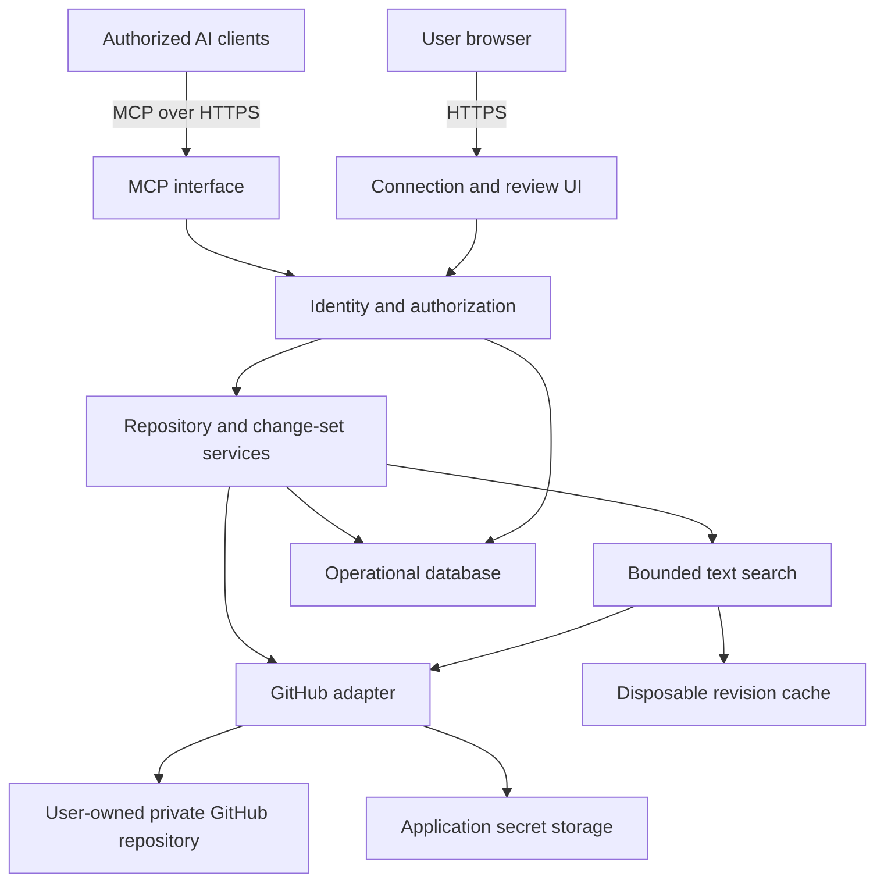

# ContextDB Architecture

Status: proposed architecture for v0.1. This document describes what to build; it does not imply that any component has been implemented or provisioned.

## 1. Architectural objective

Make a user-owned Git repository available as durable, inspectable context to multiple authorized AI clients. Markdown and Git remain useful independently of ContextDB. The service provides access, authorization, search, and controlled mutation rather than a second authoritative knowledge store.

The first release targets individuals with one private GitHub context repository per connection. Multiple clients can use that connection concurrently. Team use, additional Git providers, and native local-clone access are later extensions.

The critical path is:

```text
Client A proposes a fact
    → user approves its exact diff
    → ContextDB commits the change
    → Client B reads the new revision
```

## 2. System topology



Deploy these components as one application initially. Module boundaries should make policy and storage behavior testable without requiring separate services.

## 3. Components and responsibilities

| Component | Responsibilities |
| --- | --- |
| MCP interface | Validate structured requests, expose capabilities, return bounded results and consistent errors |
| Web interface | GitHub connection, repository selection, client grants, proposal review, revocation |
| Identity and authorization | Resolve authenticated principals, enforce repository/path/capability grants, validate approval ownership |
| Repository service | Resolve revisions, list and read permitted files, enforce format and size limits |
| Change-set service | Create immutable proposals, generate diffs, validate approvals, apply commits, track retries |
| Search service | Search permitted paths and Markdown at a known revision, paginate and rank results |
| GitHub adapter | Obtain installation tokens, read Git objects, create commits, advance refs, retrieve history |
| Operational database | Store identities, connection mappings, grants, proposals, approvals, and application outcomes |
| Disposable cache | Hold bounded repository snapshots or search data that can be rebuilt from GitHub |

A provisional implementation stack is TypeScript, an MCP SDK compatible with the selected clients, a GitHub API library, and a relational database. Framework, host, database vendor, and dependency versions remain undecided. Choose them after validating authorization and client connectivity.

## 4. Authoritative and operational storage

### GitHub repository

Authoritative for committed context, file organization, accepted revisions, and change history. The configured branch is the current accepted state; callers cannot freely select another repository or branch to bypass a grant.

### Operational database

Authoritative for ContextDB access grants and approval events. It is not a knowledge database.

Minimum entities:

| Entity | Essential fields |
| --- | --- |
| User | Internal ID, verified external identity |
| Repository connection | Owner, installation ID, repository ID, configured branch, status |
| Client grant | Principal, connection, permitted paths and capabilities, expiry/revocation |
| Change set | ID, creator, connection, base revision, operations, digest, reason, expiry, state |
| Approval | Approver, change-set ID, exact digest/base revision, timestamp |
| Application result | Idempotency key, change-set ID, resulting commit, outcome |

Pending proposals can contain private context. Encrypt stored drafts, define short retention, and avoid putting their contents in application logs. Losing operational state may require reconnecting clients and discarding pending changes; committed knowledge remains in Git.

### Cache

Cache only permitted content, keyed by repository, revision, and effective authorization scope. Bound memory/storage, expire unused entries, and invalidate access on revocation. Cache misses must be recoverable from GitHub.

The architectural promise is “no second authoritative context store,” not “the service never temporarily handles or stores content.” This distinction must be visible in privacy documentation.

## 5. Authentication and trust boundaries

There are two distinct authorization relationships:

1. **AI client → ContextDB:** an authenticated grant permits specific operations on a specific connection.
2. **ContextDB → GitHub:** the GitHub App installation authorizes access to selected repositories.

A GitHub installation token does not establish the identity or permissions of an MCP caller. The service must verify that the signed-in user can access the installation and selected repository, bind grants server-side, and issue credentials intended for ContextDB. MCP authorization requires audience validation and prohibits downstream token passthrough. [MCP authorization specification](https://modelcontextprotocol.io/specification/2025-06-18/basic/authorization)

Keep the GitHub App private key and installation tokens server-side. Use narrowly scoped permissions, obtain tokens on demand, and refresh them as needed; installation tokens expire after one hour. [GitHub App authentication](https://docs.github.com/en/apps/creating-github-apps/authenticating-with-a-github-app/authenticating-as-a-github-app-installation)

Permission enforcement applies equally to file reads, search snippets, diffs, history, and writes. Denying direct file access is insufficient if another tool exposes the same content.

Repository instructions are untrusted content relative to service policy. They can guide organization, but cannot authorize writes, expand grants, change security settings, or approve proposals.

## 6. Read and search consistency

At the beginning of a read/search operation, resolve the configured branch to a commit. Read its tree and blobs, and return that revision with the result. Related requests may pin the returned revision so an agent can inspect a consistent snapshot.

Search filenames, titles, tags, and Markdown bodies. Start with literal matching and simple ranking; do not depend on a provider's search index being immediately current after a write. Return paths, bounded snippets, pagination, and explicit truncation indicators.

An unpinned read after a successful commit must resolve the new branch head. A pinned read can intentionally return an older revision and must label it clearly. No-match and incomplete-search are different outcomes.

Initial capacity limits are proposed in `design.md`; benchmark them before publishing capacity claims. Embeddings and persistent semantic indexes are outside v0.1.

## 7. Mutation architecture

Use immutable change sets rather than shared staging state or a public shell. A change set binds a collection of file operations to one repository, branch, and base commit.

```mermaid
sequenceDiagram
    participant AI as AI client
    participant S as ContextDB
    participant U as User browser
    participant G as GitHub
    AI->>S: Propose operations against base revision
    S->>S: Validate permissions, paths, limits; store immutable draft
    S-->>AI: Diff, proposal ID, review URL
    U->>S: Authenticate and review proposal
    U->>S: Approve exact digest and base revision
    S->>G: Create tree and commit with expected base parent
    S->>G: Advance configured branch without force
    G-->>S: Success or conflict
    S-->>U: Applied commit or actionable failure
    AI->>S: Read proposal status
    S-->>AI: Applied commit or conflict details
```

Construct all file changes in one Git tree and one commit. Advance the branch without force. If another writer has advanced it, reject the stale change instead of overwriting the competing work. GitHub supports non-forced reference updates. [GitHub reference API](https://docs.github.com/en/rest/git/refs)

The baseline assumes forward-only branch history. Ref updates are not a general database compare-and-swap API: externally forced history changes require reconciliation and are outside normal v0.1 operation. Validate concurrency behavior against actual GitHub before finalizing the adapter.

An approval binds to the exact proposal content and base. Rewriting or rebasing the proposal requires a new approval. A write grant can replace per-change approval only for operations within its explicit scope.

Use idempotency keys and durable application outcomes. If a timeout occurs after a ref update, reconcile GitHub state and the proposed commit before retrying. Never assume a timed-out write failed.

## 8. Failure behavior

| Failure | Required behavior |
| --- | --- |
| Branch advanced | Return conflict; preserve draft and competing changes; require regeneration |
| GitHub unavailable or rate limited | Return retryable error with guidance; avoid aggressive retry loops |
| Commit objects created but ref update failed | Do not report success; objects are not accepted context until reachable from the configured branch |
| Ambiguous apply outcome | Reconcile before retrying or allowing a replacement apply |
| Installation or grant revoked | Deny access and invalidate relevant sessions/cache; retain only permitted operational records |
| Approval expired or content changed | Require new approval |
| Branch protection blocks write | Explain the restriction; do not weaken repository settings automatically |
| Search capacity exceeded | Return a clear limit/incomplete result rather than pretending to search everything |

## 9. Security requirements

- Allow only approved repository-relative paths and supported Markdown files. Reject traversal, absolute paths, symlinks, submodules, executable content paths, and workflow/configuration mutations outside the context format.
- Apply operation, file, result, request-rate, and total repository limits.
- Validate OAuth redirects, token audience, review ownership, CSRF protection, and tenant isolation.
- Keep content and credentials out of telemetry; record authenticated actor, operation, status, and identifiers needed for debugging.
- Detect obvious secrets on write, while documenting that detection is incomplete.
- Treat deletion and revert as changes to the visible repository state, not erasure from Git history.
- Test malicious repository instructions, unauthorized reads through search/history, duplicate retries, and concurrent writes.

Git history is useful provenance, but it is neither independently verified model identity nor a tamper-proof compliance audit. Store authenticated client/user identity separately from optional model-supplied labels.

## 10. Deployment and replaceability

The hosted release needs an HTTPS endpoint, secret storage, a database, bounded cache, health checks, metadata-only error monitoring, and backups of operational state. Hosting cost must be measured under explicit quotas before promising unlimited free service.

Self-hosting should use the same application and GitHub backend, with documented configuration and deployment instructions. A local Git backend and stdio transport are separate later features, not prerequisites for self-hosting.

Revoking ContextDB must leave ordinary Markdown and Git history accessible to the owner. Document independent repository backups; GitHub availability and Git history are not substitutes for a separate backup copy.

## 11. Validation before implementation commitments

Validate two actual AI clients against the selected MCP transport and authorization implementation. Record supported client versions/plans and avoid claiming universal connectivity from MCP support alone.

Prove multi-file atomic commits, simultaneous writes, timeout recovery, review ownership, and revocation. Use these results to finalize the tool contract and deployment stack. See `plan.md` for the proposed delivery sequence and `design.md` for product and interface behavior.
